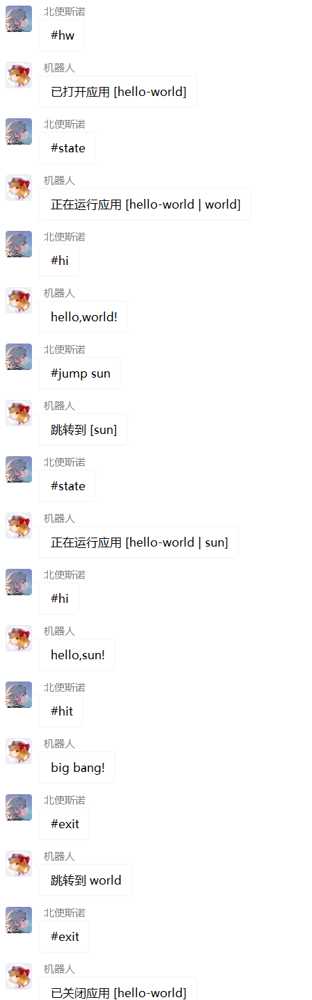

# Ayaka 0.3.8
针对Nonebot2框架 Onebot_v11协议的文字游戏开发辅助插件


<b>注意：由于更新pypi的readme.md需要占用版本号，因此其readme.md可能不是最新的，强烈建议读者前往[github仓库](https://github.com/bridgeL/nonebot-plugin-ayaka)以获取最新版本的帮助</b>


# 更新记录

<details>
<summary>历史更新记录</summary>

## 0.3.0 
借助contextvar内置模块，全部重写了之间的代码，现在它们被合并为一个单文件，并能实现ayaka插件先前提供的所有功能，但不幸的是，其无法兼容0.2.x的ayaka插件，需要代码迁移 

## 0.3.1 
规定了应用启动后的默认初始状态为 init 

## 0.3.2 
增加了较为完善的注释 

## 0.3.3 
在本文档中更新了部分帮助

## 0.3.5
将ayaka_master集成进本插件中

## 0.3.6
**不兼容** 

修改了AyakaStorage和AyakaApp的两处方法：
- plugin_storage
- group_storage

修改内容：

取消了suffix参数，现在，你需要在最后一个name中指定suffix，否则，AyakaStorage中的path属性将指向一个文件夹

迁移方式：

`app.plugin_storage("name")` -> `app.plugin_storage("name.json")`

`app.plugin_storage("test", "name", suffix=".txt") `-> `app.plugin_storage("test", "name.txt")`


## 0.3.7

<del>增进了ayaka_master的使用体验，现在为app.help赋值时，插件将自动去除app.help首尾的white-space字符</del>

修改了ayaka中send_many的实现方式（不影响使用）

增加了一条安装步骤，解决nb生成的默认toml文件的依赖冲突问题

</details>

## 0.3.8

增进了ayaka_master的使用体验，现在为app.help赋值时，插件将自动去除其首尾的white-space字符

例如，你可以直接填写
```python
app.help = '''

你好

啊啊

'''
```

实际存入的帮助是
```pythno
app._help = {
    "init":"你好\n\n啊啊"
}
```

增加了关于`app.group_storage`的帮助，并增加了一个插件示例

# 安装

1. 修改nonebot工作目录下的`pyproject.toml`文件，将`python = "^3.7.3"`修改为`python = "^3.8.0"`
2. `poetry add nonebot-plugin-ayaka` 
3. `poetry run playwright install chromium`
4. `bot.py`无需修改，只要在ayaka衍生插件里正常导入就行：`from ayaka import AyakaApp`

**ayaka衍生插件需要nonebot来加载**

如果没有用到无头浏览器截图的功能，可忽略`poetry run playwright install chromium`


## 配置

推荐配置（非强制要求）
```
COMMAND_START=["#"]
COMMAND_SEP=[" "]
```

# 快速了解

通过ayaka插件，二次封装nonebot2提供的api，提供专用api，便于其他文字游戏插件的编写

基于ayaka的衍生插件示例库 https://github.com/bridgeL/ayaka_plugins

基于ayaka的小游戏合集 https://github.com/bridgeL/nonebot-plugin-ayaka-games

## 基本特性
- 状态机
- 命令隔离
- 数据隔离

## ayaka 内置插件

ayaka内部已安装一份特殊的综合管理插件，它基于ayaka插件而实现

命令一览：
- 启用/permit
- 禁用/forbid
- 插件/plugin
- 状态/state
- 帮助/help
  
所有ayaka衍生插件只需要编写app.help，就可以在用户输入 `#help <插件名>` 后获取该插件的帮助

## 代码速看

```python

'''
    hello world
    
    ayaka可以帮助你实现命令隔离
'''
from ayaka import AyakaApp

app = AyakaApp("hello-world")

# 你可以不写帮助
# app.help


# 桌面状态下
@app.on_command("hw")
async def app_entrance():
    await app.start()
    # app运行后，进入指定状态(state = "world")
    app.set_state("world")


# 只有world状态可以退出，其他状态运行该指令均为返回world状态
@app.on_state_command(["exit", "退出"], "*")
async def app_exit():
    if app.state == "world":
        await app.close()
    else:
        app.set_state("world")
        await app.send("跳转到 world")


# 对世界、月亮和太阳打个招呼
@app.on_state_command("hi", ["world", "moon", "sun"])
async def hello():
    await app.send(f"hello,{app.state}!")


# 对世界、月亮和太阳来个大比兜
@app.on_state_command("hit", "world")
async def hit():
    await app.send("earthquake")


@app.on_state_command("hit", "moon")
async def hit():
    await app.send("moon fall")


@app.on_state_command("hit", "sun")
async def hit():
    await app.send("big bang!")


# 跳转状态
@app.on_state_command("jump", "*")
async def jump_to_somewhere():
    if not app.arg:
        await app.send("没有参数！")
    else:
        next_state = str(app.arg)
        app.set_state(next_state)
        await app.send(f"跳转到 [{next_state}]")
```



# 术语解释

## 无状态应用

例如，简单复读我说的话的应用

那么对于该应用而言，我之前说了啥都是无所谓的，它只需要复读我当前正在说的这句就行了。也就是说，无论我曾经下达过什么指令，都不会影响到该应用的状态，它是永恒不变的，即无状态应用

无状态应用在注册回调时，使用`app.on_command`和`app.on_text`即可

## 有状态应用 

例如，代码速看中的hello-world应用

我发送hi指令时，应用需要根据自身的状态（earth/moon/sun）给出不同的响应，因此它是有状态应用

有状态应用在注册回调时，需要使用`app.on_state_command`和`app.on_state_text`

## 应用启用/禁用

该应用（不管是`无状态应用`还是`有状态应用`）的指令是否可以响应

比如禁用了hello-world应用后，当你发送`hw`时，bot将不会触发回调

## 应用运行/关闭 

是指`有状态应用`是否正在运行

比如当前群聊并没有运行应用时，你发送`hw`，bot将运行hello-world应用

## 单一应用原则

一个群聊同一时间只能运行一个`有状态应用`，避免过于混乱的情形，如果想要运行另一个应用，请先关闭当前的应用

`无状态应用`没有运行和关闭的概念，你发完指令，它立刻就会回应你

# API

## app属性一览表
| 名称      | 类型                   | 功能                                           |
| --------- | ---------------------- | ---------------------------------------------- |
| intro     | `str`                  | 应用介绍（帮助dict中key为init所对应的value）   |
| help      | `str`                  | 当前应用在当前状态下的帮助                     |
| all_help  | `str`                  | 当前应用的所有帮助                             |
| state     | `bool`                 | 当前应用的状态                                 |
| valid     | `bool`                 | 应用在当前设备 是否被启用                      |
| bot       | `Bot`                  | 当前机器人                                     |
| group     | `AyakaGroup`           | 当前群组                                       |
| event     | `MessageEvent`         | 当前消息事件                                   |
| message   | `Message`              | 当前消息                                       |
| arg       | `Message`              | 删除了命令后剩下的消息部分                     |
| args      | `List[MessageSegment]` | 删除命令后，依照分隔符分割，并移除空数据       |
| cmd       | `str`                  | 本次响应是针对哪个命令                         |
| bot_id    | `int`                  | 当前机器人的qq号                               |
| group_id  | `int`                  | 当前群聊的群号                                 |
| user_id   | `int`                  | 当前消息的发送者的qq号                         |
| user_name | `str`                  | 当前消息的发送者的群名片或昵称（优先为群名片） |
| cache     | `AyakaCache`           | 为当前群组当前应用提供的独立缓存数据空间       |

## app方法一览表
| 名称             | 功能                                      | 是否异步 |
| ---------------- | ----------------------------------------- | -------- |
| start            | 运行应用                                  | 是       |
| close            | 关闭应用                                  | 是       |
| send             | 发送消息                                  | 是       |
| send_many        | 发送合并转发消息                          | 是       |
| t_send           | 定时器触发回调时所使用的专用发送消息方法  | 是       |
| set_state        | 设置应用状态（在应用运行时可以设置）      | \        |
| on_command       | 注册桌面模式下的命令回调                  | \        |
| on_state_command | 注册应用运行时在不同状态下的命令回调      | \        |
| on_text          | 注册桌面模式下的消息回调                  | \        |
| on_state_text    | 注册应用运行时在不同状态下的消息回调      | \        |
| on_everyday      | 每日定时触发回调（东8区）                 | \        |
| on_interval      | 在指定的时间点后开始循环触发（东8区）     | \        |
| add_listener     | 为该群组添加对 指定私聊 的监听            | \        |
| remove_listener  | 移除该群组对 指定私聊/所有其他私聊 的监听 | \        |

# 如何编写ayaka衍生插件

给出几份例程代码以帮助读者理解使用

## 如何使用例程代码？
所有的示例代码都可以在 [基于ayaka的衍生插件示例库](https://github.com/bridgeL/ayaka_plugins) 中找到

下载其中的插件，放到nonebot工作目录下的`src/plugins`中，随后启动nonebot即可

## 插件编写范例 echo

```python
'''
    具有状态机的复读模块
'''
from ayaka import AyakaApp

app = AyakaApp("echo")

# 得益于ayaka内置插件 ayaka_master
# 用户可通过#help命令展示插件帮助，只需编写app.help即可
app.help = '''复读只因
特殊命令一览：
- reverse 开始说反话
- back 停止说反话
- exit 退出
'''

# 另一种写法
app.help = {
    "init": "复读只因\n特殊命令一览：\n- reverse 开始说反话\n- exit 退出",
    "reverse": "说反话模式\n- back 停止说反话"
}


# 桌面状态下
@app.on_command("echo")
async def app_entrance():
    # 输入参数则复读参数（无状态响应
    # > #echo hihi
    # < hihi
    if app.arg:
        await app.send(app.arg)
        return

    # 没有输入参数则运行该应用
    await app.start()


# app运行后，进入初始状态(state = "init")

# 正常复读
@app.on_state_text()
async def repeat():
    await app.send(app.message)


# 任意状态均可直接退出
@app.on_state_command(["exit", "退出"], "*")
async def app_exit():
    await app.close()


# 通过命令，跳转到reverse状态
@app.on_state_command(["rev", "reverse", "话反说", "反", "说反话"])
async def start_rev():
    app.set_state("reverse")
    await app.send("开始说反话")


# 反向复读
@app.on_state_text("reverse")
async def reverse_echo():
    msg = str(app.message)
    msg = "".join(s for s in reversed(msg))
    await app.send(msg)


# 通过命令，跳转回初始状态
@app.on_state_command("back", "reverse")
async def back():
    app.set_state()
    await app.send("话反说止停")
```

## 插件编写范例 a plus b

```python
'''
    a + b 
    
    各群聊间、各插件间，数据独立，互不影响；不需要自己再专门建个字典了
'''
from ayaka import AyakaApp

app = AyakaApp("a-plus-b")


@app.on_command("set_a")
async def set_a():
    app.cache.a = int(str(app.arg)) if app.arg else 0
    await app.send(app.cache.a)


@app.on_command("set_b")
async def set_b():
    app.cache.b = int(str(app.arg)) if app.arg else 0
    await app.send(app.cache.b)


@app.on_command("calc")
async def calc():
    a = app.cache.a or 0
    b = app.cache.b or 0
    await app.send(str(a+b))
```

## 定时器 Timer

注意，定时器触发回调时，由于缺乏消息激励源，app的大部分属性(bot、group、event、valid、cache、user_name等)将无法正确访问到，并且无法使用app.send方法，需要使用专用的t_send方法

```python
'''
    整点报时
'''
from ayaka import AyakaApp

app = AyakaApp("整点报时")


@app.on_interval(60, s=0)
async def every_minute():
    await app.t_send(bot_id=2317709898, group_id=666214666, message="小乐")


@app.on_interval(3600, m=0, s=0)
async def every_hour():
    await app.t_send(bot_id=2317709898, group_id=666214666, message="大乐")


@app.on_everyday(h=23, m=59, s=59)
async def every_day():
    await app.t_send(bot_id=2317709898, group_id=666214666, message="呃呃呃一天要结束了")

```

## 插件编写范例 +1

```python
'''
    +1s 

    使用app.group_storage永久保存数据到本地

    使用app.cache快速存取数据，但是app.cache中的对象会在bot重启后丢失
'''
from asyncio import sleep
from random import choice
from typing import Dict
from ayaka import AyakaApp

app = AyakaApp("加一秒")
app.help = '''
每人初始时间值为0
每有3个不同的人执行一次或若干次加1，boss就会完成蓄力，吸取目前时间值最高的人的时间，如果有多人，则均吸取1点
boss时间值>=10时，游戏结束，时间值<=boss的人中，时间值最高的人获胜，一切重置
- 加一秒 启动游戏
- exit/退出 退出游戏（数据保留）

游戏内指令：
- +1 让你的时间+1
- 我的 查看你目前的时间
- boss 查看boss的时间和能量
- 全部 查看所有人参与情况，以及boss的时间和能量
'''

feelings = [
    "感觉身体被掏空",
    "感受到一阵空虚",
    "的时间似乎变快了",
    "似乎被夺走了什么东西"
]

restarts = [
    "世界被虚空的狂风撕碎",
    "世界在不灭的火焰中湮灭",
    "&*@）#……游戏出故障了",
    "限界的界世了越超间时的ssob"
]


async def get_user_data():
    users = await app.bot.get_group_member_list(group_id=app.group_id)
    user_data = {u["user_id"]: u["card"] or u["nickname"] for u in users}
    return user_data


def get_max(data: Dict[int, int]):
    '''
        data 是保存了 uid-time 数据的字典
    '''
    # 转换为items列表，方便排序
    items = list(data.items())
    items.sort(key=lambda x: x[1], reverse=True)

    uids = []
    if not items:
        return uids

    time_max = items[0][1]
    for uid, time in items:
        if time == time_max:
            uids.append(uid)
        else:
            break

    return uids


class PlayerGroup:
    def __init__(self) -> None:
        # 获得AyakaStorage
        # 如果给定了default，那么在load时，若文件不存在，会写入default作为初始值
        self.storage = app.group_storage("time.json", default={})
        self.load()

    def load(self):
        # 加载数据，如果不存在文件，则自动创建
        data: dict = self.storage.load()
        # json.load时，得到的key都是str类型，因此需要转换
        self.data = {int(uid): time for uid, time in data.items()}

    def save(self):
        # 保存数据
        # 如果是json文件，则data在写入时会自动通过json.dumps转换
        # 如果是txt文件，则data只能是str类型
        self.storage.save(self.data)

    def get_time(self, uid: int) -> int:
        '''获取uid对应的时间值'''

        # 如果不存在则设置默认值，并保存
        if uid not in self.data:
            self.data[uid] = 0
            self.save()
            return 0

        # 存在则返回
        return self.data[uid]

    def change_time(self, uid: int, diff: int):
        '''获取uid对应的时间值，如果不存在，返回为0'''

        time: int = self.data.get(uid, 0)

        # 修改time
        time += diff

        # 保存
        self.data[uid] = time
        self.save()

        # 返回修改后的值
        return time

    def clear_all(self):
        self.data = {}
        self.save()


class Boss:
    boss_default = {
        "time": 0,
        # 记录不同的人的发言
        "uids": []
    }

    max_time = 10
    max_power = 3

    def __init__(self, player_group: PlayerGroup) -> None:
        # 获得AyakaStorage
        self.storage = app.group_storage(
            "boss.json",
            default=self.boss_default
        )
        self.load()
        self.player_group = player_group

    def load(self):
        # 加载数据
        self.data = self.storage.load()

    def save(self):
        self.storage.save(self.data)

    @property
    def time(self) -> int:
        return self.data["time"]

    @time.setter
    def time(self, v: int):
        self.data["time"] = v
        self.save()

    @property
    def power(self):
        return len(self.data["uids"])

    def clear_power(self):
        self.data["uids"] = []
        self.save()

    def add_power(self, uid: int):
        # 防止重复
        uids: list = self.data["uids"]
        if uid in uids:
            return
        uids.append(uid)
        self.data["uids"] = uids
        self.save()

    def kill(self, data: dict):
        '''
            data 是保存了 uid-time 数据的字典
        '''
        # 发动攻击，清除power
        self.clear_power()

        # 记录吸取情况
        uids = get_max(data)

        # 吸取时间
        for uid in uids:
            self.player_group.change_time(uid, -1)
        self.time += len(uids)

        # 告知吸取情况
        return uids

    @property
    def state(self):
        info = f"boss目前的时间：{self.time}/{self.max_time}\nboss目前的能量：{self.power}/{self.max_power}"
        if self.power >= self.max_power - 1:
            info += "\nboss即将发动攻击！"
        if self.time >= self.max_time - 1:
            info += "\nboss的时间即将到达顶峰！"
        return info


class Game:
    def __init__(self) -> None:
        self.player_group = PlayerGroup()
        self.boss = Boss(self.player_group)

    def get_winners(self):
        boss_time = self.boss.time
        data = self.player_group.data
        # 时间值小于等于boss的人
        data = {uid: time for uid, time in data.items() if time <= boss_time}
        return get_max(data)


@app.on_command("加一秒")
async def _():
    await app.start()
    await app.send(app.help)
    app.cache.game = Game()


@app.on_state_command(["exit", "退出"])
async def _():
    await app.send("数据已保存")
    await app.close()


@app.on_state_command("我的")
async def inquiry():
    game: Game = app.cache.game
    time = game.player_group.get_time(app.user_id)
    await app.send(f"[{app.user_name}]目前的时间：{time}")


@app.on_state_command("boss")
async def inquiry_boss():
    game: Game = app.cache.game
    await app.send(game.boss.state)


@app.on_state_command("全部")
async def inquiry_boss():
    game: Game = app.cache.game

    # boss
    info = game.boss.state

    # 所有人
    data = game.player_group.data

    if not data:
        await app.send(info)
        return

    # 查找名字
    user_data = await get_user_data()

    for uid, time in data.items():
        info += f"\n[{user_data[uid]}]目前的时间：{time}"
    await app.send(info)


@app.on_state_command(["加1", "加一", "+1", "+1s"])
async def plus():
    game: Game = app.cache.game

    # 玩家
    time = game.player_group.change_time(app.user_id, 1)
    await app.send(f"[{app.user_name}]的时间增加了！目前为：{time}")

    # boss
    game.boss.add_power(app.user_id)
    await app.send(game.boss.state)

    if game.boss.power < game.boss.max_power:
        return

    # boss 攻击
    uids = game.boss.kill(game.player_group.data)

    await app.send("boss发动了攻击...")
    await sleep(2)
    await app.send("...")
    await sleep(2)

    if not uids:
        await app.send("无事发生")
        return

    # 查找名字
    user_data = await get_user_data()

    # 告知被攻击情况
    items = [f"[{user_data[uid]}] {choice(feelings)}" for uid in uids]
    await app.send("\n".join(items))

    if game.boss.time < game.boss.max_time:
        return

    # 游戏结束，告知胜利者
    uids = game.get_winners()

    await sleep(2)
    await app.send(f"boss的时间超越了世界的界限，{choice(restarts)}...")
    await sleep(2)
    await app.send("...")
    await sleep(2)

    items = [f"[{user_data[uid]}]" for uid in uids]
    info = "在上一个世界中：" + "、".join(items) + " 是最终的赢家！"
    await app.send(info)

    game.player_group.clear_all()
    game.boss.time = 0

```

## 截图 playwright

注意，win平台使用playwright时需要关闭fastapi的reload功能

```python

'''
    can can baidu
'''

from pathlib import Path
from ayaka import get_new_page, AyakaApp, MessageSegment

app = AyakaApp("看看baidu")


@app.on_command("ccb")
async def _():
    async with get_new_page() as p:
        await p.goto("http://www.baidu.com", wait_until="networkidle")
        path = Path("test.png").absolute()
        await p.screenshot(path=path)
    image = MessageSegment.image(path)
    await app.send(image)

```

## 自动分割消息

ayaka插件将会自动根据配置项中的分割符来分割消息，例如

```
#test a   b c
```

会在ayaka插件处理后变为

```python
@app.on_command("test")
async def _():
    # 此时app身上的如下属性的值应该是：...
    assert app.cmd == "test"
    assert str(app.arg) == "a   b c"
    assert str(app.args[0]) == "a"
    assert str(app.args[1]) == "b"
    assert str(app.args[2]) == "c"
```

# 未来计划

1. 更新关于`app.plugin_storage`和`app.group_storage`的帮助
2. 提供aiosqlite数据库支持（或许？
3. 考虑拆散帮助的设置方式，针对每条命令回调、消息回调设置帮助，而不是像现在编写一个总体的帮助
